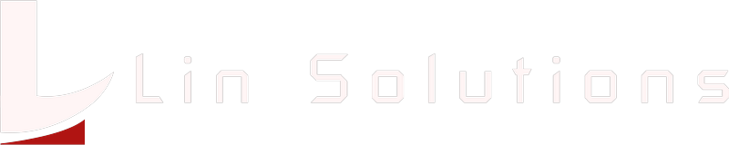

# LinSolutions | Software & Automação Inteligente com IA

<p align="center">
  
</p>

<p align="center">
  <strong>Soluções avançadas em Inteligência Artificial, automações de fluxos corporativos e desenvolvimento de softwares sob medida para empresas que buscam escala, redução de custos e excelência operacional.</strong>
</p>

<p align="center">
  <a href="#sobre">Sobre</a> •
  <a href="#funcionalidades">Funcionalidades</a> •
  <a href="#tecnologias">Tecnologias</a> •
  <a href="#como-executar">Como Executar</a> •
  <a href="#configuracao">Configurações</a> •
  <a href="#contato">Contato</a>
</p>

---

## 🚀 Sobre o Projeto

A **LinSolutions** desenvolve ecossistemas digitais de alta performance, conectando Inteligência Artificial Generativa, agentes autônomos e automação de processos a operações corporativas de ponta a ponta. 

Esta landing page foi arquitetada com foco em conversão, performance, estética visual tech premium e funcionalidades interativas de agendamento automático.

---

## ✨ Funcionalidades

- **Design System com Identidade Visual Estrita:**
  - Paleta com contraste refinado: Preto Profundo (`#0C0101`), Branco Suave (`#FFF5F5`) e Vermelho Rubi (`#B01412`).
  - Tipografia moderna com **Poppins** (Google Fonts).
  - Micro-animações, cards com efeito glassmorphism e iluminação dinâmica via gradientes.
- **Alternador de Tema (Dark / Light Mode):**
  - Transição fluida com persistência no `localStorage`.
  - Troca dinâmica inteligente da logomarca oficial para máxima nitidez em ambos os modos.
- **Sistema de Agendamento de Consultorias Integrado:**
  - Validação de disponibilidade de horários.
  - Sincronização e geração de convites de reunião (`.ics` e Google Meet / Calendar).
  - Disparo automático de e-mail de notificação para a equipe (`contato@linsolutionsbr.com`).
  - Disparo automático de e-mail de confirmação para o lead.
- **Copywriting Persuasivo:** Focado em tomadas de decisão C-Level, destacando problemas do mercado vs soluções definitivas com IA.
- **Responsividade Total:** Adaptado perfeitamente para desktop, tablets e smartphones.

---

## 🛠️ Tecnologias Utilizadas

- **Front-end:** HTML5 Semântico, CSS3 Moderno (Vanilla com Design Tokens e Container Queries), JavaScript ES6+.
- **Back-end:** Node.js, Express.js.
- **E-mails & Calendário:** Nodemailer, biblioteca ICS, Google Calendar API.
- **Estilização & Tipografia:** CSS Custom Properties, Google Fonts (Poppins).

---

## 💻 Como Executar Localmente

### Pré-requisitos
- [Node.js](https://nodejs.org/) (versão 16 ou superior)
- Git

### Passo a Passo

1. **Clone o repositório:**
   ```bash
   git clone https://github.com/tidaniellino/linsolutionsbr.git
   cd linsolutionsbr
   ```

2. **Instale as dependências:**
   ```bash
   npm install
   ```

3. **Configure as variáveis de ambiente:**
   Copie o arquivo `.env.example` para `.env`:
   ```bash
   cp .env.example .env
   ```
   *Edite o arquivo `.env` com suas credenciais de SMTP e e-mail para habilitar os disparos reais.*

4. **Inicie a aplicação:**
   ```bash
   npm start
   ```

5. **Acesse no navegador:**
   Abra [http://localhost:3000](http://localhost:3000).

---

## ⚙️ Variáveis de Ambiente (`.env`)

```env
PORT=3000
ADMIN_EMAIL=contato@linsolutionsbr.com
EMAIL_FROM="LinSolutions <contato@linsolutionsbr.com>"

# Servidor SMTP para disparo de e-mails
SMTP_HOST=smtp.exemplo.com
SMTP_PORT=587
SMTP_SECURE=false
SMTP_USER=seu-usuario-smtp
SMTP_PASS=sua-senha-smtp
```

---

## 📬 Contato

- **E-mail:** [contato@linsolutionsbr.com](mailto:contato@linsolutionsbr.com)
- **Website:** [https://linsolutionsbr.com](https://linsolutionsbr.com)

---

<p align="center">
  © 2026 LinSolutions Tecnologia & Inteligência Artificial. Todos os direitos reservados.
</p>
